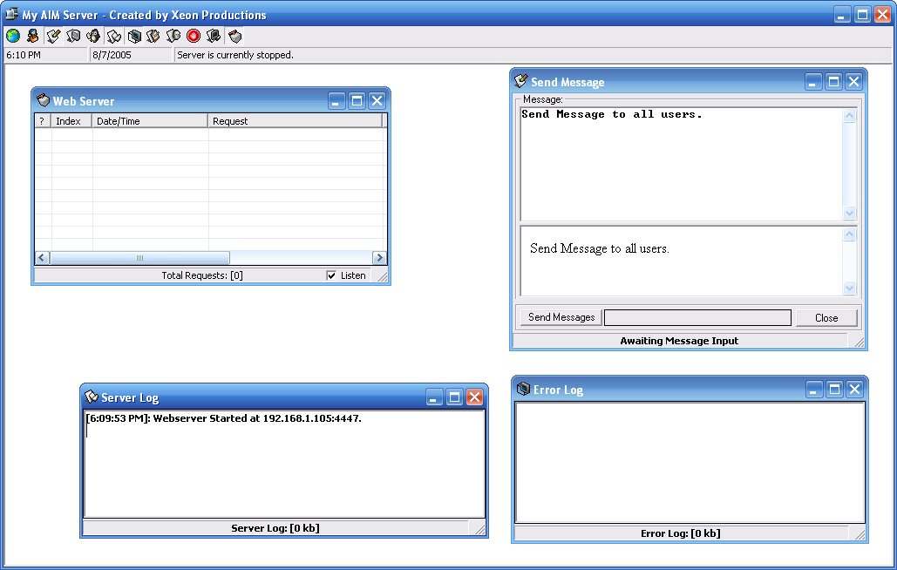



## AOL Instant Messenger Server \(OSCAR\)

### Description

Well, I&#8217;ve had this code sitting around here for about 2 months. I coded then when I had my internet cut off and just because I thought it would be interesting to make an AOL Instant Messenger server in Visual Basic and an OSCAR server at that. Plus I had never seen any even attempt to make an AIM server in general. As of right now the reason I have stopped working on this ambitious project is because I have essentially no attention span to work on it anymore. And in addition I am very frustrated I could not get Chat&#8217;s working.

But what does work on this AIM server is registration, logging in, instant messages, buddy list (feedbag), all of AIM&#8217;s add-on stuff (sometimes), Profiles, email changing and formatting screen names. What does not work is directory info, chat, stats service, and a lot of features I never got through with implementing on the server side. Now if you do want to run this I must warn you I hard coded my IP address in a lot of places. But for you I made it easy to find. Just find &#8220;255.255.255.255&#8221; and replace it with your IP address. Anyway, this runs on 3 ports, 1 for the authorizer server, 1 for the BOS server, and another for add-on services which I did not get implemented. Now the web server is the main method of registration, but if you want you can also insert the screen names directly into the database.

Now the official AIM client does sign on to my server, you just have to set the server inside of AIM&#8217;s connection preferences to your IP or dns name and signon.

I hope someone will continue my work, if they do I want my name to be remembered and not thrown away. I have laid down the groundwork for a private communications network using the official AIM client. And I hope someone will benefit from this code.

As for OSCAR documentation there are various good sources, I suggest http://iserverd1.khstu.ru/oscar/, http://www.kingant.net/oscar/, and http://joust.kano.net/wiki/oscar/moin.cgi/. Thank you and good day!
 
### More Info
 

             |
---                |---
**Submitted On**   |2005-08-07 18:13:46
**By**             |[Brandon Scott](https://github.com/Planet-Source-Code/PSCIndex/blob/master/ByAuthor/brandon-scott.md)
**Level**          |Advanced
**User Rating**    |4.9 (94 globes from 19 users)
**Compatibility**  |VB 6\.0
**Category**       |[Complete Applications](https://github.com/Planet-Source-Code/PSCIndex/blob/master/ByCategory/complete-applications__1-27.md)
**World**          |[Visual Basic](https://github.com/Planet-Source-Code/PSCIndex/blob/master/ByWorld/visual-basic.md)
**Archive File**   |[AOL\_Instan192209872005\.zip](https://github.com/Planet-Source-Code/brandon-scott-aol-instant-messenger-server-oscar__1-62118/archive/master.zip)

